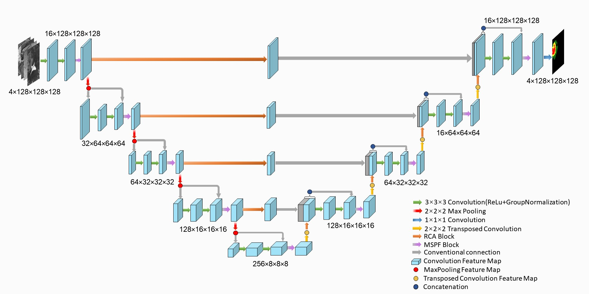

# SegNet2MRI
we propose a method that is to segment the brain tumor by using PyTorch.




## Quikly start
```python
run train1.py
```
The code of "train1.py" is related to other ".py" files, please read it patiently, if you have any questions, welcome to contact me: 

:sunny: 1091627587@qq.com or lyhyun318925@gmail.com :sunny:

